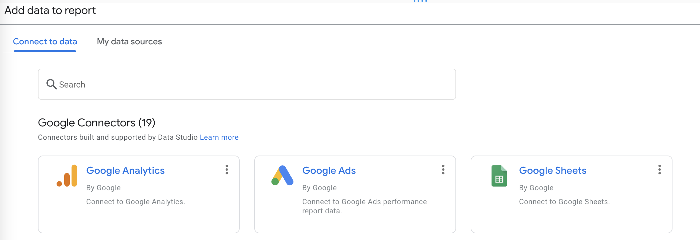

# 2. Koneksi Dataset ke Data Studio

1. Buka [datastudio.google.com](https://datastudio.google.com) kemudian pilih `Create`-`Report`

.png>)

2\. Pilih `Google Sheets` sebagai data connector, kemudian pilih `Authorize`

3\. Pilih Sheet `Maternal Mortality`, pada Worksheet pilih `MMR`, kemudian klik `Add` dan `Add to Report`

.png>)

4\. Selanjutnya lakukan verifikasi tipe data masing-masing kolom dengan memilih `Resource` - `Manage added data sources`

&#x20;.png>)

5\. Pilih `Edit`

.png>)

6\. Ubah tipe data pada `Continent` dari `text` menjadi `Continent`

.png>)

7\. Pastikan semua tipe data sudah sesuai dengan screenshot ini, kemudian klik `Done`

.png>)

